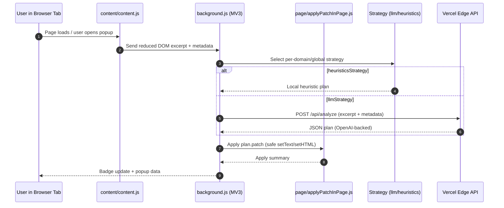

## PDP Rewriter

MV3 browser extension that detects PDPs (Product Detail Pages), proposes improved copy for key fields, and safely auto‑applies DOM edits with revert/re‑apply. An optional Vercel Edge proxy provides OpenAI‑backed analysis and copy.

#### Downloads
- **Chrome (zip)**: [`pdp-rewriter-extension.zip`](https://github.com/agurod42/fabric-pdp/releases/latest/download/pdp-rewriter-extension.zip)
- **Safari (Xcode project, tgz)**: [`pdp-rewriter-safari-project.tgz`](https://github.com/agurod42/fabric-pdp/releases/latest/download/pdp-rewriter-safari-project.tgz)

### Highlights
- **Auto‑apply**: Patch DOM with an audit summary; revert or re‑apply from the popup.
- **Configurable**: Whitelist and per‑domain overrides via Options.
- **Field extraction**: Title, description, shipping, returns.
- **PDP detection**: Pluggable strategies — `llmStrategy` (backend) or `heuristicsStrategy` (local).

### Architecture
- **Extension**: Background orchestrates; content script reduces DOM; page helper applies safe `setText`/`setHTML`; popup shows status and diffs; options manages whitelist and strategy overrides.
- **Edge proxy**: Stateless `/api/analyze` and `/api/generate` endpoints with server‑side API keys.
- **Strategies**: Return a strict JSON plan with `is_pdp`, discovered selectors, and a minimal patch.



#### Key decisions
- **Configurability and data control**: Whitelist and per‑domain overrides minimize unintended runs and data egress, at the cost of a small initial setup.
- **Deterministic inputs**: The content script builds a compact, sanitized HTML excerpt to reduce cost, noise, and drift between runs.
- **Edge proxy over dedicated backend**: Stateless Vercel Edge functions keep operational overhead low and latency low; we trade off persistence/observability that a bespoke backend would provide.
- **MV3 lifecycle constraints**: Service‑worker wake/sleep and message passing drive small caches and simple orchestration, at the expense of lifecycle complexity.
- **Safety‑first DOM mutations**: Only `setText`/`setHTML` on safe nodes; sanitization and selector denylists (e.g., excluding `meta/script/link`); reversible via revert/re‑apply.
- **Strategy trade‑off (quality vs latency)**: LLM‑backed plans are richer but slower/costlier; heuristic plans are instant/offline but may be minimal.

### How it works
1) `content/content.js` produces a reduced HTML excerpt + metadata and asks background for a plan.
2) `background.js` selects a strategy:
   - `llmStrategy`: Calls the Edge `POST /api/analyze`.
   - `heuristicsStrategy`: Computes a local plan.
3) If `plan.is_pdp` is true, background applies `plan.patch` via `page/applyPatchInPage.js` and caches an apply summary.
4) `popup/` shows diffs and provides Revert / Re‑apply.

Patch operations are restricted to `setText` and `setHTML`, with a selector denylist and automatic value prefixing (`[PDP]`) unless explicitly suppressed internally.

#### Strategies
- `heuristicsStrategy`: Fast signal scoring and selector discovery; may return empty patches.
- `llmStrategy`: Uses the Edge API to return a strict JSON plan.

#### Configuration (Options)
- **Global strategy**: Choose default strategy.
- **Per‑domain overrides**: Map host pattern → strategy.
- **Whitelist**: Empty runs on all sites; otherwise restrict by host patterns (supports wildcards like `*.shopify.com`).

### Local development

#### Repo
- `packages/extension/`: MV3 extension (background service worker, content script, page helper, popup, options, strategies)
- `packages/proxy-vercel/`: Vercel Edge API for `analyze` and `generate`

#### Get started

- **Prereqs**: Node 18+ (or 20+); macOS only if packaging for Safari.

- **Install**:
  ```bash
  npm install
  ```

- **Run the proxy (optional)**:
  ```bash
  # With Vercel CLI installed and OPENAI env configured
  npm -w packages/proxy-vercel run dev
  ```

- **Proxy env (Vercel)**:
  - `OPENAI_API_KEY` (required)
  - `OPENAI_BASE_URL` (optional; default OpenAI API)
  - `OPENAI_MODEL` (default: `gpt-4.1`)

- **Point extension to your proxy**: Update `PROXY_URL` and `PROXY_GENERATE_URL` in `packages/extension/background.js`.

- **Load in Chrome**:
  1) Open chrome://extensions
  2) Enable Developer mode
  3) Load unpacked → select `packages/extension`

- **Badge states**: `…` working, `PDP` detected, `AP` applying, `ERR` error.

#### Deploy proxy (Vercel)
1) `cd packages/proxy-vercel`
2) `vercel` (or GitHub → Vercel integration)
3) Add env vars in Vercel Project Settings → Environment Variables
4) Note the deployment URL and update the extension background constants.

#### Safety & limitations
- DOM patching is restricted and sanitized; selectors targeting `meta`, `script`, and `link` tags are excluded.

### License
MIT
