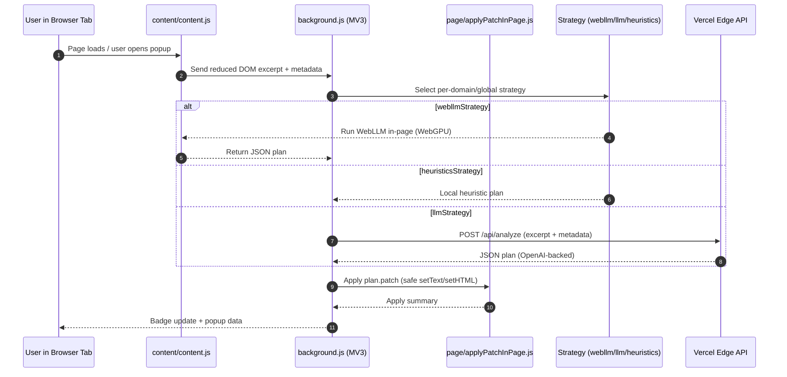

## PDP Rewriter

An MV3 browser extension that detects PDPs (Product Detail Pages) with a pluggable strategy (WebLLM in-page, backend LLM, or fast heuristics), proposes improved copy for key fields, and auto-applies safe DOM edits with revert/re-apply support. A lightweight Vercel Edge proxy provides OpenAI-backed analysis and copy generation.

### Features
- **Auto-apply**: Patch DOM with an audit summary; revert/re-apply from popup.
- **Field extraction**: Title, description, shipping, returns.
- **PDP detection**: Decide if current page is a merchant PDP.
- **Strategies**: `webllmStrategy` (local WebGPU), `llmStrategy` (backend), `heuristicsStrategy` (fast local).
- **Whitelist + per-domain strategy overrides**: Configure from Options.

### Monorepo Layout
- `packages/extension/`: MV3 extension (background service worker, content script, options, popup, strategies)
- `packages/proxy-vercel/`: Vercel Edge API for `analyze` and `generate`

### Architecture
- **Extension (MV3)**: Split into a background service worker, a content script, an in-page patch helper, a popup UI, an options page, and pluggable strategies.
  - **Content script (`content/content.js`)**: Sanitizes the live DOM into a small, deterministic HTML excerpt + page metadata. This limits payload size and reduces privacy risk, while producing consistent inputs for downstream strategies.
  - **Background (`background.js`)**: Orchestrates the flow. It chooses a strategy globally or per-domain, requests a plan, applies the patch via the page helper, manages the badge state, and caches an apply summary for the popup.
  - **In-page patch helper (`page/applyPatchInPage.js`)**: Applies a constrained set of operations (`setText` and `setHTML`) only to safe targets. It enforces sanitization rules, a denylist for risky selectors (e.g., `script`, `meta`, `link`), and optional value prefixing.
  - **Popup (`popup/`)**: Surfaces status, diffs, and controls (Revert / Re-apply) for the current tab.
  - **Options (`options/`)**: Hosts whitelist configuration and strategy selection/overrides.
- **Strategies (`strategies/`)**: Produce a strict JSON plan with `is_pdp`, discovered selectors, and a minimal patch.
  - **`webllmStrategy`**: Runs a local LLM in-page using WebGPU when available. Pros: strong privacy (no page data leaves the device) and good latency after warmup. Cons: device/browser support constraints and larger cold starts.
  - **`llmStrategy`**: Calls a Vercel Edge endpoint backed by OpenAI. Pros: broad compatibility and typically higher model quality. Cons: network latency/cost and data egress (mitigated via DOM reduction and server-side key management).
  - **`heuristicsStrategy`**: Fast, local signal scoring and selector discovery. Pros: instant and offline-friendly. Cons: less accurate PDP detection and lower-quality rewrite proposals.
- **Edge Proxy (`packages/proxy-vercel/`)**: Stateless endpoints (`/api/analyze`, `/api/generate`) with API keys kept server-side. Edge runtime keeps latencies low globally.



#### Key Decisions & Trade-offs
- **Privacy vs. Quality**: Local `webllmStrategy` keeps data on-device but requires WebGPU and has cold-start costs. Remote `llmStrategy` yields higher quality and broad hardware support at the expense of network egress and costs.
- **Speed vs. Accuracy**: `heuristicsStrategy` is immediate and reliable under constrained environments but less precise than LLM-based approaches.
- **Safety vs. Flexibility**: Patching is intentionally limited to text/HTML updates on safe elements with sanitization/denylist/prefixing. This reduces risk of breakage or injection but cannot handle complex widget rewrites.
- **Determinism vs. Rich Context**: DOM is reduced to a small, stable excerpt to make prompts predictable and reduce payload size. Full-page context could improve quality but increases variability, cost, and privacy exposure.
- **MV3 Constraints vs. Simplicity**: MV3’s ephemeral background encourages message-based orchestration and small state caches. This improves security and compliance with Chrome’s model, at the cost of added complexity around wake-ups and lifecycle.
- **Edge Functions vs. Dedicated Backend**: Vercel Edge offers low-latency, stateless scaling with simple ops. A dedicated backend would enable more custom persistence/observability, but increases operational burden.
- **Configurability vs. Autonomy**: Whitelist and per-domain strategy overrides give control over where/how the extension runs, reducing accidental changes at the cost of some setup.

### How It Works
1) `content/content.js` sanitizes the current DOM into a reduced HTML excerpt + metadata; asks background to resolve a plan.
2) `background.js` picks a strategy per domain/global setting and resolves a plan:
   - `webllmStrategy`: Runs WebLLM in the page (WebGPU). Fallbacks to backend on error.
   - `llmStrategy`: Calls the Vercel `analyze` endpoint (OpenAI backed) to return a plan.
   - `heuristicsStrategy`: Fast local signal scoring + selector discovery.
3) If `plan.is_pdp` is true, background applies `plan.patch` in-page via `page/applyPatchInPage.js` and caches an apply summary.
4) `popup/` shows diffs (previous vs current), applied steps, and provides Revert/Re-apply.

Selectors and content are validated to avoid script injection; patch operations are restricted to `setText` (title) and `setHTML` (others), with a denylist and automatic value prefixing (`[PDP]`) unless explicitly suppressed by internal flows.

### Strategies
- `heuristicsStrategy`: Fast PDP signal scoring and best-effort selector discovery; returns a schema-compatible plan with empty patches.
- `llmStrategy`: Calls the Edge API `POST /api/analyze` which uses OpenAI to return a strict JSON plan.
- `webllmStrategy`: Executes a strict prompt client-side using WebLLM. Requires WebGPU and a WebLLM runtime available in the page context. The repo includes a vendored build at `packages/extension/vendor/webllm.min.js`, but it’s not injected by default; the strategy attempts to use existing globals (`window.WebLLM`/`window.webllm`) and falls back to backend if unavailable.

### Options
Open the extension’s Options page:
- **Global Strategy**: Choose default strategy.
- **Per-domain Overrides**: Map host pattern → specific strategy.
- **Whitelist**: If empty, extension runs on all sites; otherwise restrict by host patterns (supports wildcards like `*.shopify.com`).

### Development
Prereqs:
- macOS for Safari tooling (optional)
- Node 18+ (or 20+), npm

Install:

```bash
npm install
```

Run the Edge proxy locally (optional; otherwise use a deployed URL):

```bash
# In another terminal, with Vercel CLI installed and OPENAI env configured
npm -w packages/proxy-vercel run dev
```

Environment for proxy (Vercel):
- `OPENAI_API_KEY` (required)
- `OPENAI_BASE_URL` (optional; default OpenAI API)
- `OPENAI_MODEL` (default: `gpt-4.1`)

Update the extension background endpoints if you deploy the proxy:
- In `packages/extension/background.js` set `PROXY_URL` and `PROXY_GENERATE_URL` to your deployment.

Load the extension in Chrome:
1) Open chrome://extensions
2) Enable Developer mode
3) Load unpacked → select `packages/extension`

Popup shows status for the active tab. The badge cycles: `…` (working), `PDP` (detected), `AP` (applying), `ERR` (error).

### Deploy the Proxy (Vercel)
1) `cd packages/proxy-vercel`
2) `vercel` (or GitHub → Vercel integration)
3) Add env vars in Vercel Project Settings → Environment Variables
4) Note the deployment URL and update the extension background constants.

### Manual Packaging
- Chrome: zip the contents of `packages/extension` and upload to the Chrome Web Store dashboard.
- Safari: generate an Xcode project using Apple’s converter, then build/sign in Xcode.

Chrome (local):

```bash
cd packages/extension
zip -r ../pdp-rewriter-chrome.zip . -x "**/node_modules/**" "**/.DS_Store"
```

Safari (local):

```bash
# Requires Xcode 13+ on macOS
xcrun safari-web-extension-converter "$(pwd)/packages/extension" \
  --app-name "PDP Rewriter" \
  --project-location "$(pwd)/build-safari" \
  --copy-resources --no-open --force --macos-only
```

This produces an Xcode project under `build-safari/` you can open and sign.

### Safety & Limitations
- DOM patching is restricted and sanitized; selectors targeting meta/script/link tags are excluded.
- WebLLM requires WebGPU-capable browsers/devices; it gracefully falls back to backend.

### License
MIT
